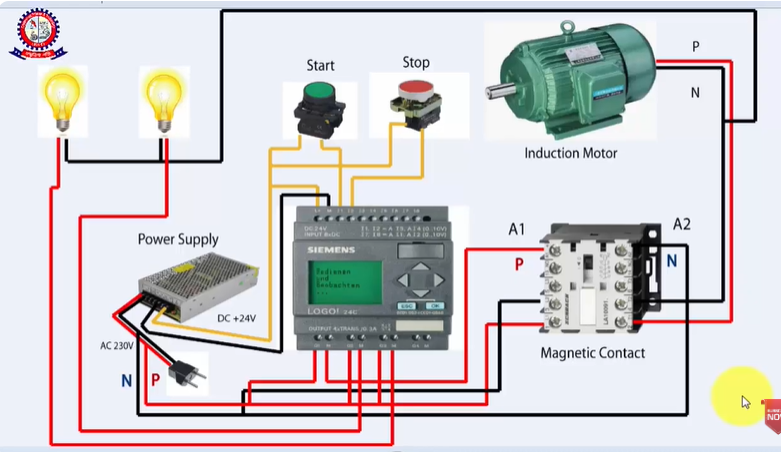

# Automatic Motor On/Off Control System (PLC)

This repository contains the documentation, I/O configurations, and ladder logic code for an automated industrial motor control system. The system features a standard start/stop design with thermal overload safety integration and automated interlocks.

---

## 🗺️ System Overview

The system is designed to safely start and stop a three-phase industrial electric motor. It includes manual pushbuttons for operator control, a latching circuit to sustain operation after a button release, and safety overrides to protect the hardware from electrical faults.

* **Control Methods:** Manual Start/Stop pushbuttons, automatic sensor-driven overrides.
* **Safety Features:** Thermal Overload Trip monitoring, Emergency Stop integration, and status indication.

---

## 🔌 Circuit & I/O Mapping

The system configuration relies on discrete digital inputs and outputs assigned to standard Siemens PLC addresses (e.g., S7-1200 / S7-300).

### PLC Inputs & Outputs Table

| Tag Name | PLC Address | Hardware Type | Description |
| :--- | :--- | :--- | :--- |
| **I_E_Stop** | `I0.0` | Digital Input (NC) | Emergency Stop button (Normally Closed for failsafe operation) |
| **I_Overload** | `I0.1` | Digital Input (NC) | Thermal Overload Relay contact (Opens if motor overheats) |
| **I_Stop_Btn** | `I0.2` | Digital Input (NC) | Manual STOP Pushbutton (Normally Closed) |
| **I_Start_Btn** | `I0.3` | Digital Input (NO) | Manual START Pushbutton (Normally Open) |
| **O_Motor_Contactor** | `Q0.0` | Digital Output | Energizes the power contactor coil to spin the motor |
| **O_Run_Lamp** | `Q0.1` | Digital Output | Green indicator light showing the motor is running |
| **O_Fault_Lamp** | `Q0.2` | Digital Output | Red flashing indicator showing an overload fault condition |

---

## 🪜 PLC Ladder Diagram Logic

The system utilizes a standard **latch (seal-in) circuit**. Because the Start Pushbutton is momentary, the motor contactor uses its own auxiliary contact to maintain power to the output coil after the operator releases the button.

### Rung 1: Main Motor Control & Latching
Power flows through all safety features (E-Stop, Overload, Stop) before reaching the Start mechanism.

### Plc code download link:
Here is given the download ling:
[Download PLC Code](../Circuit%20Diagram/ladder%20code/Motor%20On%20%20&%20OFF%20with%20signal%20lamps.lld)