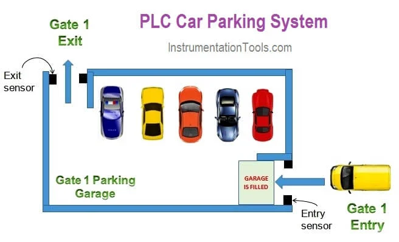

# Automated Car Parking Control System (PLC)

This repository contains the system architecture, I/O mapping configurations, and Structured Text (SCL) logic for an automated municipal or private car parking garage management system. 

---

## 🗺️ System Overview

The system regulates vehicle entry and exit for a parking facility with a fixed layout capacity. It prevents over-filling, tracks live occupancy data, and automates gate operations via localized sensor feedback.

* **Target Capacity:** 50 Vehicles maximum.
* **Entry Logic:** Automatically opens the entry gate if a vehicle is detected **and** the lot has available spaces.
* **Exit Logic:** Automatically opens the exit gate when an internal vehicle approaches the egress zone.
* **Safety Features:** Built-in auto-close timeouts to prevent unauthorized tailgating or stuck-open conditions.

---

## 🔌 Circuit & I/O Mapping

The hardware configuration is mapped to discrete digital inputs and outputs on a standard central PLC processing unit.

### Image:

### PLC Ladder code:
Download the diagram:
[carparking system](../Circuit%20Diagram/ladder%20code/Car%20parking%20Project%20using%20PLC.lld)